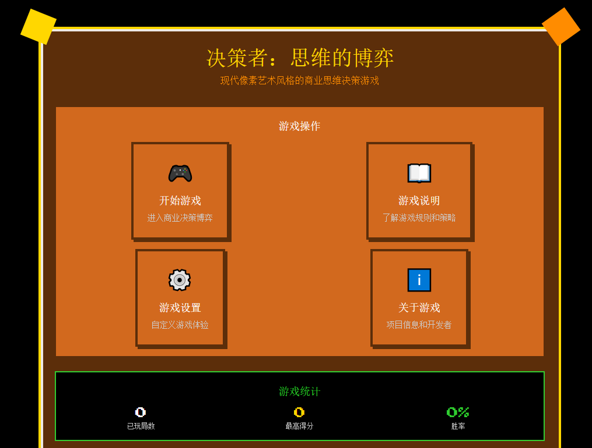

# 决策者：思维的博弈 - 财商策略小游戏

《决策者：思维的博弈》是一款现代像素艺术风格的商业思维决策游戏。玩家扮演一家初创科技公司的CEO，需要在5轮关键决策中平衡资本、声誉、创新、士气四个核心指标，与AI进行策略博弈，目标是实现公司的可持续发展。

<p align="center">
  
</p>

## 游戏特色

### 🎮 核心玩法
- **策略决策**：每回合从5种商业策略中选择，影响公司四项核心指标
- **AI对抗**：基于Minimax算法的智能AI，会根据你的决策调整策略
- **风险系统**：累积风险值可能导致随机惩罚，增加游戏挑战性
- **组合效果**：特定策略组合可触发额外奖励效果

### 🎨 视觉设计
- **像素艺术风格**：采用经典的8-bit像素美学，搭配暖色调配色方案
- **流畅动画**：使用Framer Motion实现丰富的交互动画效果
- **响应式布局**：适配各种屏幕尺寸，支持移动端游戏

### 📊 策略深度
- **5种基础策略**：
  - 稳健理财：稳健的资金管理策略
  - 市场扩张：高投入高回报的市场开拓
  - 技术转化：将研发成果商业化
  - 团队激励：投资员工福利提升士气
  - 品牌营销：品牌推广促进销售增长
- **3种组合效果**：策略组合可触发额外奖励
- **智能分析**：游戏结束后提供详细的策略分析报告

## 技术栈

### 前端技术
- **React 18** + **TypeScript**：现代化的前端开发框架
- **Framer Motion**：流畅的动画效果
- **Tailwind CSS**：高效的样式系统
- **Vite**：快速的构建工具
- **React Router**：客户端路由管理

### 设计规范
- **8px网格对齐系统**：确保设计的一致性
- **像素艺术字体**：使用Press Start 2P字体
- **暖色调配色方案**：金色、橙色、棕色为主色调
- **无障碍访问支持**：良好的可访问性设计

## 快速开始

### 环境要求
- Node.js >= 16
- pnpm 包管理器

### 安装依赖
```bash
pnpm install
```

### 开发模式
```bash
pnpm dev
```

### 构建生产版本
```bash
pnpm build
```

### 预览构建结果
```bash
pnpm preview
```

## 部署

### 部署到 Vercel
1. Fork 本项目
2. 登录 [Vercel](https://vercel.com/)
3. 点击 "New Project"
4. 选择你的仓库
5. 保持默认设置，点击 "Deploy"

### 部署到 Netlify
1. Fork 本项目
2. 登录 [Netlify](https://netlify.com/)
3. 点击 "New site from Git"
4. 选择你的仓库
5. 设置构建命令为 `pnpm build`，发布目录为 `dist`
6. 点击 "Deploy site"

## 游戏规则

### 核心指标
- **资本 (Capital)**：公司的现金流和融资能力 (0-200)
- **声誉 (Reputation)**：品牌知名度和市场地位 (0-200)
- **创新 (Innovation)**：产品研发和技术优势 (0-200)
- **士气 (Morale)**：团队凝聚力和员工满意度 (0-200)

### 胜负条件
- **胜利**：综合能力值 > AI (差距 > 10分) 或任意属性值 ≥ 180
- **失败**：任意属性值 < 50 或综合能力值 < 80
- **平局**：5回合结束后双方实力相当

### 综合能力计算
综合能力 = 0.4×资本 + 0.3×声誉 + 0.2×创新 + 0.1×士气

## 开发信息

### 项目结构
```
src/
├── components/     # UI组件
├── contexts/       # React Context状态管理
├── hooks/          # 自定义Hook
├── lib/            # 工具函数
├── pages/          # 页面组件
├── types/          # TypeScript类型定义
└── App.tsx         # 应用入口
```

### 开发者
- **开发者**：hhhh124hhhh
- **邮箱**：hhhh124hhhh@qq.com
- **版本**：1.0.0
- **开发时间**：2025年10月

## 贡献

欢迎任何形式的贡献！请先阅读我们的[贡献指南](CONTRIBUTING.md)和[行为准则](CODE_OF_CONDUCT.md)。

### 如何贡献
1. Fork 本项目
2. 创建你的功能分支 (`git checkout -b feature/AmazingFeature`)
3. 提交你的更改 (`git commit -m 'Add some AmazingFeature'`)
4. 推送到分支 (`git push origin feature/AmazingFeature`)
5. 开启一个 Pull Request

### 开发设置
```bash
# 克隆项目
git clone https://github.com/hhhh124hhhh/decision-maker-game.git

# 进入项目目录
cd decision-maker-game

# 安装依赖
pnpm install

# 启动开发服务器
pnpm dev
```

## 社区和支持

- 报告问题：[GitHub Issues](https://github.com/hhhh124hhhh/decision-maker-game/issues)
- 功能请求：[GitHub Discussions](https://github.com/hhhh124hhhh/decision-maker-game/discussions)
- 贡献代码：阅读[贡献指南](CONTRIBUTING.md)

## 路线图

- [ ] 添加多人对战模式
- [ ] 增加更多策略选项
- [ ] 添加成就系统
- [ ] 支持多语言
- [ ] 添加移动端原生应用

## 致谢

感谢以下开源项目和资源：

- [React](https://reactjs.org/) - 用户界面库
- [Framer Motion](https://www.framer.com/motion/) - 动画库
- [Tailwind CSS](https://tailwindcss.com/) - CSS框架
- [Vite](https://vitejs.dev/) - 构建工具
- [Google Fonts](https://fonts.google.com/) - Press Start 2P 字体
- 像素艺术社区提供的设计灵感和资源支持

特别感谢所有为本项目做出贡献的开发者！

## 许可证

本项目采用MIT许可证，详情请查看 [LICENSE](LICENSE) 文件。

[](https://opensource.org/licenses/MIT)